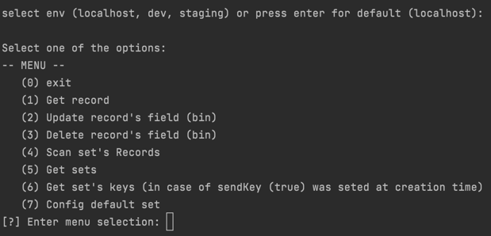

# Aerospike CLI-Prompt
***
> The tool come to boost daily work.

## Table of Contents
***
* [Technologies Used](#technologies-used)
* [Features](#features)
* [Screenshots](#screenshots)
* [Setup](#setup)
* [Properties](#properties)
* [TODO](#todo)
* [Project Status](#project-status)
* [Contact](#contact)
<!-- * [License](#license) -->

## Technologies Used 
***
- Golang

## Features
***
- Scan set's Records. 
- Get set's keys.
- Get record.
- Update record's Bins.
- Delete record's Bin.

## Screenshots
***

<!-- If you have screenshots you'd like to share, include them here. -->

## Setup
***
- build to the relevant OS, go the to src folder and run: env GOARCH=<arch> GOOS=<OS> go build -o as-cli
- config property.conf file
- run

## Properties
***
### logger
- logger.clean.old.log: [true/false]  
  > Delete the old log file on app launch.
- logger.level.file: [DEBUG/ INFO/ WARN/ FATAL/ ERROR/ SILENT]
  > Config log level.
- logger.path: \<file path>
  > Config log file path.

### aerospike
- aerospike.default.namespace:
  > Config aerospike namespace.

- aerospike.client.host.\<env>:
  > Config aerospike host.  
  > For multiple env, create a line for each env, for example:  
  > <ul> <li>aerospike.client.host.localhost=localhost</li>  
  > <li>aerospike.client.host.dev=aerospike.dev.com</li></ul>

- aerospike.client.port.\<env>:
  > Config aerospike port.  
  > <b>Note:</b> Should be match to aerospike.client.host.<<env>env>

- aerospike.connection.timeout.sec:
  > Config aerospike connection timeout

- aerospike.default.env: 
  > Config the default env.  
  > <b>Note:</b> Should be match to aerospike.client.host/port.<<env>env>

- aerospike.scan.all.chunk.size:
  > Config the returning chunk result for "Get all keys" (full data).

- aerospike.all.set.keys.chunk.size: \<split the results to chunks>
  > Config the returning chunk result for "Get all keys" (id only,...).

- aerospike.default.set:
  > Config aerospike default set

- aerospike.console.set.name.alias:
  > Replace the world "set" with the alias in the console.

- aerospike.console.key.name.alias:
  > Replace the world "key" with the alias in the console.
  
### pre run script
- app.manager.pre.cmd:
  > Config path to a pre run script.  
  > Note: Can be useful for opening a VPN connection or a tunneling.

- app.manager.pre.cmd.arg: \<arg for the pre run>
  > Config arg for the pre script

## TODO
***
- Support multiple namespaces
- Write records
- Delete records

## Project Status
Project is: _in progress_

## Contact
***
Created by [@ori vardi](mailto:vardi.ori@gmail.com) - feel free to contact me!

<!-- ## License -->
<!-- This project is open source and available under the [... License](). -->
